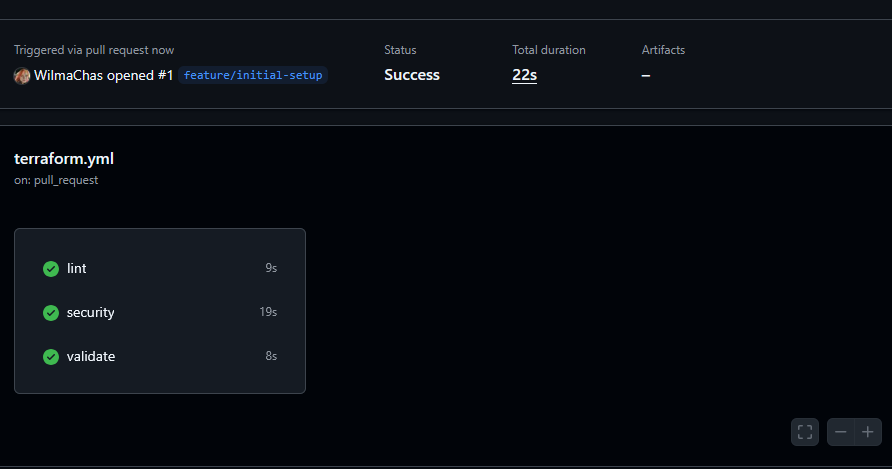
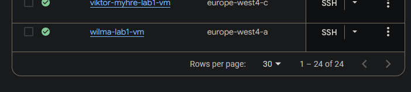

# Lab 1: Terraform VM on GCP

## Project Overview
This project demonstrates how to provision and configure a Linux virtual machine on Google Cloud Platform using Terraform. The VM is set up with basic security hardening, automated daily backups, and a CI pipeline to ensure code quality and safety. The goal of the lab is to practice infrastructure-as-code, cloud provisioning, and automated vertification.

## How to Run
To deploy and manage the VM using Terraform locally:

```bash
# Initialize Terraform and download necessary providers
terraform init

# Preview the infrastructure changes before applying
terraform plan

# Apply the changes to create the VM
terraform apply```

(Screen shot step 5)

(Screen shot of vm i gcp console)
```

## Proof of successful pipeline


## Proof of successful VM deployment


## Security Measures

- **UFW (Uncomplicated Firewall)**:  
  Blocks all incoming traffic by default, allowing only SSH connections. This reduces the attack surface by preventing unauthorized access to other services or ports.

- **Fail2Ban**:  
  Monitors authentication logs and automatically bans IPs that show suspicious behavior, such as repeated failed SSH login attempts. This protects the VM against brute-force attacks.

- **Unattended-Upgrades**:  
  Automatically installs security updates for the system and packages. This ensures the VM stays up-to-date with the latest security patches without manual intervention.

- **Daily Backup Policy**:  
  Configured via a Google Compute Resource Policy to create daily snapshots of the VM disk. In case of accidental deletion, misconfiguration, or compromise, data can be restored quickly.

These measures collectively provide a basic but effective security posture for a publicly accessible Linux VM.

